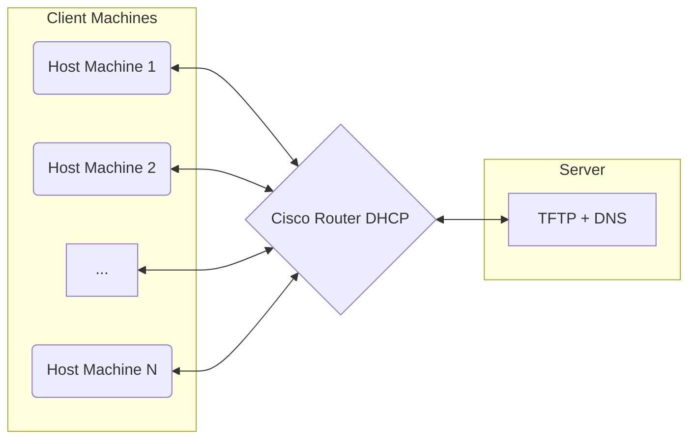

# 🧩 PXE Boot System 

This is the documentation of the PXE (Preboot Execution Environment) project implemented for the **IT-LAB-UAI**. The goal of this setup is to boot and provision machines in the lab automatically with a default configuration — making the setup and initialization process fully automated and consistent across devices.

PXE enables machines to boot over the network without requiring local storage, ideal for mass deployment and rapid reconfiguration.


## 🧱 Prerequisites

Before proceeding with this guide, make sure you have already completed the configuration of the following components:

- [Cisco Router Configuration](https://github.com/IT-LAB-UAI/Documentation/blob/main/Cisco/README.md)
- [Netboot.xyz Setup](https://github.com/IT-LAB-UAI/Documentation/blob/main/Netboot.xyz/README.md)
- [TFTP Server Setup](https://github.com/IT-LAB-UAI/Documentation/blob/main/TFTP/README.md)
- [DNS Configuration](https://github.com/IT-LAB-UAI/Documentation/blob/main/DNS/README.md)

Each of the guides above provides installation steps and basic configuration needed for those services to operate correctly.

## 📝 What This Guide Covers

In this documentation, we will:

- Explain how the different components work together to provide PXE boot functionality.
- Show what specific configuration tweaks are needed on each service so that everything integrates smoothly.

> 🛈 For you to know:  
> The operating system used in this configuration is **Debian 12**, and we’ll be using a `preseed.cfg` file to automate the entire installation process. Don’t worry — we’ll go through how that works later in this guide.


> ⚠️ **Note:** This guide does **not** walk through installing each individual service.  
> For complete installation instructions, refer to the dedicated documentation linked above.  
> This guide focuses on tying the pieces together and ensuring interoperability across the full system.
---

## 🖥️ System Architecture

Here is a quick diagram of how the system works:

First of all, you have a server that hosts all the PXE images and configuration files, along with the TFTP and DNS servers. Then you have the Cisco router, which currently functions as the DHCP provider. Finally, you have the host machines, which are connected to the router and access the PXE server through it.


## 🔄 System Workflow

Now that you know what the system architecture looks like, let’s go over how the full PXE workflow operates:

1. The user initiates PXE boot on a host machine.
2. The host sends a DHCP request to the **Cisco router**.
3. The router responds by assigning an **IP address, gateway, DNS, and subnet mask** to the host.
4. Along with the network configuration, the router also provides the **TFTP server information** (next-server and boot filename).
5. The host then contacts the **TFTP server**, which sends back the specified PXE boot file.
6. Once the PXE file is loaded onto the host, a menu appears (provided by **netboot.xyz**).
7. From this menu, the user selects the Debian 12 preseed option and specifies the server URL containing the configuration.
8. The installer uses that URL to pull configuration files and automatically launches the OS installation.

```mermaid
sequenceDiagram
    participant Host as Host Machine
    participant Router as Cisco Router (DHCP)
    participant TFTP as TFTP Server
    participant Netboot as Netboot.xyz Menu
    participant Server as Server (Preseed Configs)

    Host->>Router: DHCP request (PXE Boot)
    Router-->>Host: Assign IP, Gateway, DNS, Subnet Mask
    Router-->>Host: Provide TFTP server info (PXE boot file)
    Host->>TFTP: Request PXE boot file
    TFTP-->>Host: Return PXE boot file
    Host->>Netboot: Load and display boot menu
    Host->>Server: Fetch Debian 12 preseed config
    Server-->>Host: Return config files
    Host->>Host: Start automated Debian 12 installation
   ```
   > 💡 **Note:**  
> In this configuration, the PXE process includes a boot menu. The presence and behavior of this menu depends entirely on the **PXE file** you load via TFTP.  
> 
> For this setup, we are using the **default `kpxe` file from netboot.xyz**, which includes a pre-built boot menu. However, if you prefer a more customized or minimal setup, you could load a different PXE file that skips the menu entirely and directly starts an installation or other process.
> 
> This is the only part of the flow that may vary depending on your specific PXE file and use case.
