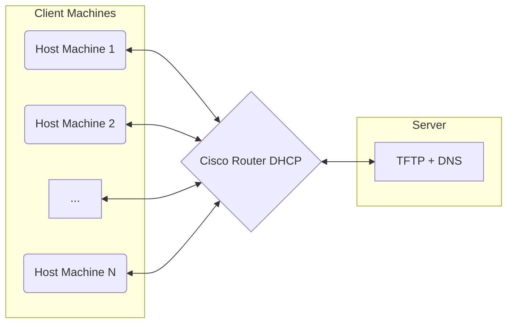

# 🧩 PXE Boot System 

This is the documentation of the PXE (Preboot Execution Environment) project implemented for the **IT-LAB-UAI**. The goal of this setup is to boot and provision machines in the lab automatically with a default configuration — making the setup and initialization process fully automated and consistent across devices.

PXE enables machines to boot over the network without requiring local storage, ideal for mass deployment and rapid reconfiguration.

## 📚 Table of Contents
- [🧱 Prerequisites](#-prerequisites)
- [📝 What This Guide Covers](#-what-this-guide-covers)
- [🖥️ System Architecture](#️-system-architecture)
- [🔄 System Workflow](#-system-workflow)
- [🧭 Walkthrough: PXE Bootfile Configuration on the Server](#-walkthrough-pxe-bootfile-configuration-on-the-server)
  - [📌 1. Define Your PXE Bootfile](#-1-define-your-pxe-bootfile)
  - [📂 2. Choose a Directory for Your PXE Files](#-2-choose-a-directory-for-your-pxe-files)
  - [⚙️ 3. Update the TFTP Server Configuration](#-3-update-the-tftp-server-configuration)
  - [🔄 4. Restart the TFTP Service](#-4-restart-the-tftp-service)
  - [✅ 5. Verify TFTP Service Is Running Correctly](#-5-verify-tftp-service-is-running-correctly)
- [📝 Configuring Unattended Installation via `preseed.cfg`](#-configuring-unattended-installation-via-preseedcfg)
- [🌐 Exposing the `preseed.cfg` File to the Network](#-exposing-the-preseedcfg-file-to-the-network)
- [🔧 Finalizing the Server-Side: What's Next?](#-finalizing-the-server-side-whats-next)
- [📡 Configure the Cisco Router](#-configure-the-cisco-router)
  - [⚙️ Cisco Router Configuration](#️-cisco-router-configuration)
- [🖥️ Final Step: Host Machine Configuration](#️-final-step-host-machine-configuration)
  - [⚙️ BIOS/UEFI Settings](#️-biosuefi-settings)
  - [⌨️ Booting into PXE](#️-booting-into-pxe)
  - [📥 Installing Debian via Preseed](#-installing-debian-via-preseed)


## 🧱 Prerequisites

Before proceeding with this guide, make sure you have already completed the configuration of the following components:

- [Cisco Router Configuration](https://github.com/IT-LAB-UAI/Documentation/blob/main/Cisco/README.md)
- [Netboot.xyz Setup](https://github.com/IT-LAB-UAI/Documentation/blob/main/Netboot.xyz/README.md)
- [TFTP Server Setup](https://github.com/IT-LAB-UAI/Documentation/blob/main/TFTP/README.md)
- [DNS Configuration](https://github.com/IT-LAB-UAI/Documentation/blob/main/DNS/README.md)

Each of the guides above provides installation steps and basic configuration needed for those services to operate correctly.

## 📝 What This Guide Covers

In this documentation, we will:

- Explain how the different components work together to provide PXE boot functionality.
- Show what specific configuration tweaks are needed on each service so that everything integrates smoothly.

> 🛈 For you to know:  
> The operating system used in this configuration is **Debian 12**, and we’ll be using a `preseed.cfg` file to automate the entire installation process. Don’t worry — we’ll go through how that works later in this guide.


> ⚠️ **Note:** This guide does **not** walk through installing each individual service.  
> For complete installation instructions, refer to the dedicated documentation linked above.  
> This guide focuses on tying the pieces together and ensuring interoperability across the full system.
---


## 🖥️ System Architecture

Here is a quick diagram of how the system works:

First of all, you have a server that hosts all the PXE images and configuration files, along with the TFTP and DNS servers. Then you have the Cisco router, which currently functions as the DHCP provider. Finally, you have the host machines, which are connected to the router and access the PXE server through it.


## 🔄 System Workflow

Now that you know what the system architecture looks like, let’s go over how the full PXE workflow operates:

1. The user initiates PXE boot on a host machine.
2. The host sends a DHCP request to the **Cisco router**.
3. The router responds by assigning an **IP address, gateway, DNS, and subnet mask** to the host.
4. Along with the network configuration, the router also provides the **TFTP server information** (next-server and boot filename).
5. The host then contacts the **TFTP server**, which sends back the specified PXE boot file.
6. Once the PXE file is loaded onto the host, a menu appears (provided by **netboot.xyz**).
7. From this menu, the user selects the Debian 12 preseed option and specifies the server URL containing the configuration.
8. The installer uses that URL to pull configuration files and automatically launches the OS installation.

```mermaid
sequenceDiagram
    participant Host as Host Machine
    participant Router as Cisco Router (DHCP)
    participant TFTP as TFTP Server
    participant Netboot as Netboot.xyz Menu
    participant Server as Server (Preseed Configs)

    Host->>Router: DHCP request (PXE Boot)
    Router-->>Host: Assign IP, Gateway, DNS, Subnet Mask
    Router-->>Host: Provide TFTP server info (PXE boot file)
    Host->>TFTP: Request PXE boot file
    TFTP-->>Host: Return PXE boot file
    Host->>Netboot: Load and display boot menu
    Host->>Server: Fetch Debian 12 preseed config
    Server-->>Host: Return config files
    Host->>Host: Start automated Debian 12 installation
   ```
   > 💡 **Note:**  
> In this configuration, the PXE process includes a boot menu. The presence and behavior of this menu depends entirely on the **PXE file** you load via TFTP.  
> 
> For this setup, we are using the **default `kpxe` file from netboot.xyz**, which includes a pre-built boot menu. However, if you prefer a more customized or minimal setup, you could load a different PXE file that skips the menu entirely and directly starts an installation or other process.
> 
> This is the only part of the flow that may vary depending on your specific PXE file and use case.

## 🧭 Walkthrough: PXE Bootfile Configuration on the Server

We’ll now begin the step-by-step walkthrough of how the entire PXE system works, starting from the server-side configuration — specifically, the PXE **bootfile**.

### 📌 1. Define Your PXE Bootfile

The first thing you need to decide is **which PXE bootfile** you want to serve. This is the file that will be delivered to the client machines during the PXE boot process.

In this configuration, we’ll be using the **default `netboot.xyz.kpxe` file** — a legacy PXE boot file provided by netboot.xyz. It comes with a built-in boot menu and is ideal for quick setup and testing.

You can generate this file by downloading it:

```bash
wget https://boot.netboot.xyz/ipxe/netboot.xyz.kpxe
```
### 📂 2. Choose a Directory for Your PXE Files

You’ll need to store the `netboot.xyz.kpxe` file in a directory accessible by your TFTP server. A good example would be the `assets/` directory inside your `netboot_xyz` project:
```bash
/netboot_xyz/assets/
```
You’re free to use a different path if you prefer — just make sure the TFTP server is configured to point to the directory where this file lives.

### ⚙️ 3. Update the TFTP Server Configuration
To expose your PXE bootfiles to the network, update the `tftpd-hpa` configuration to use your chosen directory.

Open the config file:
```bash
sudo nano /etc/default/tftpd-hpa

```
Find the line that sets the TFTP directory and change it. For example:
```bash
TFTP_DIRECTORY="/netboot_xyz/assets"
```
>📎 **Note:** Adjust the path according to your actual directory structure. This is just an example.
### 🔄 4. Restart the TFTP Service

Once you’ve updated the configuration, restart the TFTP server to apply the changes:
```bash
sudo systemctl restart tftpd-hpa
```
### ✅ 5. Verify TFTP Service Is Running Correctly

After restarting the TFTP service, it’s important to confirm that it’s running without issues. You can check its status with:

```bash
sudo systemctl status tftpd-hpa
```
If the service fails to start or shows any errors, review the following:

-   Make sure the directory you configured **exists**.
    
-   Ensure the TFTP user has the proper **permissions** to access that directory.
>🛠️ Fix any errors before continuing. A properly running TFTP server is critical for the PXE process to work.


## 📝 Configuring Unattended Installation via `preseed.cfg`

Now that the TFTP server is running and you've defined which PXE bootfile to use, let’s complete the final configuration step on the server: enabling **automated OS installation** through Debian’s preseed functionality.

### 🤖 What Is `preseed.cfg`?

Debian allows unattended installations using a configuration file called `preseed.cfg`. This file defines every aspect of the install — from language and timezone settings to disk formatting and package selection.

By using a preseed file, we ensure that every machine in the LAB is installed consistently, with **no manual intervention required** during setup.

### 🔓 Security Warning

> ⚠️ Keep in mind:  
> Since the `preseed.cfg` file must be accessible over the network, **anyone** on the network can fetch it.  
> 
> You should **never include real passwords or sensitive data** in this file, especially in plain text. In our case, we use **placeholder credentials** during installation, and later override them using **Ansible**.  
>
> Attempting to use MD5-hashed passwords didn’t work reliably — Debian seems to rehash them, making the original hash unusable.

### 🌍 Expose the `preseed.cfg` File

You’ll need to make this file available via HTTP on the PXE server (e.g., place it in `/var/www/html/preseed.cfg` or serve it from any accessible path).

Here’s an example `preseed.cfg` file that performs a full Debian 12 installation with:

- Automatic partitioning (on `/dev/nvme0n1`)
- GNOME desktop environment
- SSH server
- Firmware for Wi-Fi and network adapters

### 📄 Example: `preseed.cfg`

```cfg
##### --- Localization ---
d-i debian-installer/locale string en_US.UTF-8
d-i console-keymaps-at/keymap select es
d-i keyboard-configuration/xkb-keymap select es
d-i keyboard-configuration/layoutcode string es
d-i time/zone string America/Santiago

##### --- Network Configuration ---
d-i netcfg/choose_interface select auto
d-i netcfg/disable_autoconfig boolean false
d-i netcfg/get_hostname string debian
d-i netcfg/get_domain string local

##### --- User and Root Setup (Plain Text Passwords) ---
d-i passwd/root-login boolean true
d-i passwd/root-password password PlainText_Placeholder1
d-i passwd/root-password-again password PlainText_Placeholder1

d-i passwd/user-fullname string Default Lab User
d-i passwd/username string lab
d-i passwd/user-password password PlainText_Placeholder2
d-i passwd/user-password-again password PlainText_Placeholder2
d-i user-setup/allow-password-weak boolean true

##### --- Pre-Wipe + Partitioning (for NVMe) ---
d-i partman/early_command string \
    debconf-set partman-auto/init_automatically_partition select biggest_free; \
    for dev in $(list-devices disk); do \
        dd if=/dev/zero of=$dev bs=512 count=1 || true; \
        wipefs -a $dev || true; \
    done

d-i partman-auto/method string regular
d-i partman-auto/expert_recipe string                         \
      atomic ::                                               \
              500 10000 1000000000 ext4                       \
                      $primary{ } $bootable{ }                \
                      method{ format } format{ }              \
                      use_filesystem{ } filesystem{ ext4 }    \
                      mountpoint{ / }                         \
              .                                               \
              64 512 300% linux-swap                          \
                      method{ swap } format{ }                \
              .

d-i partman-auto/disk string /dev/nvme0n1
d-i partman-lvm/device_remove_lvm boolean true
d-i partman-md/device_remove_md boolean true
d-i partman-lvm/confirm boolean true
d-i partman-lvm/confirm_nooverwrite boolean true
d-i partman/choose_partition select finish
d-i partman/confirm boolean true
d-i partman/confirm_nooverwrite boolean true

##### --- Package Selection (GNOME + SSH + Wi-Fi Support) ---
tasksel tasksel/first multiselect gnome-desktop, ssh-server
d-i pkgsel/include string openssh-server network-manager firmware-iwlwifi firmware-realtek firmware-misc-nonfree
popularity-contest popularity-contest/participate boolean false

##### --- Bootloader ---
d-i grub-installer/only_debian boolean true
d-i grub-installer/with_other_os boolean true
d-i grub-installer/bootdev string /dev/nvme0n1

##### --- Finishing Up ---
d-i finish-install/reboot_in_progress note
```
>⚠️ **Note:**  This setup will completely wipe the machine and install Debian 12 with the GNOME desktop — so be cautious if dual-booting or preserving data is needed.
> 🔐 **Credential Reminder:**  
> This `preseed.cfg` file will create:
>
> - A **root user** with password: `PlainText_Placeholder1`  
> - A **regular user** named **"Lab Default User"**  
>   with username: `lab` and password: `PlainText_Placeholder2`
>
> These credentials are temporary and should be replaced **as soon as possible** after installation, either manually or via automation (e.g., Ansible), to ensure your desired level of security.

---

## 🌐 Exposing the `preseed.cfg` File to the Network

To allow client machines to access the `preseed.cfg` file during installation, we need to expose it via HTTP. For a quick and easy setup, we'll use **NGINX** running inside a **Docker container**.

### 🏗️ 1. Create the Project Directory

Start by creating a dedicated directory for your NGINX setup:

```bash
mkdir -p nginx/html
cd nginx
```
### 📝 2. Create the `nginx.conf` File

Inside the `nginx/` directory, create a file named `nginx.conf` and paste the following configuration:
```nginx.conf
events {}

http {
    include       mime.types;
    default_type  application/octet-stream;

    sendfile        on;
    keepalive_timeout  65;

    server {
        listen       80;
        server_name  _;

        root /usr/share/nginx/html;

        location / {
            index  index.html index.htm;
        }

        # Explicitly allow .cfg files (optional, but helps if MIME is funky)
        location ~ \.cfg$ {
            default_type text/plain;
        }

        error_page 404 /404.html;
        location = /404.html {
            root /usr/share/nginx/html;
        }

        error_page 500 502 503 504 /50x.html;
        location = /50x.html {
            root /usr/share/nginx/html;
        }
    }
}
```

### 📦 3. Define the Docker Compose File
Still inside the `nginx/` directory, create a `docker-compose.yml` file with the following content:
```yml
services:
  nginx:
    image: nginx:latest
    container_name: nginx_server
    ports:
      - "80:80"
    volumes:
      - ./nginx.conf:/etc/nginx/nginx.conf:ro
      - ./html:/usr/share/nginx/html:ro
    restart: unless-stopped

```

### 📁 4. Add Your `preseed.cfg` File

Move your previously created `preseed.cfg` file into the `html/` directory:
```bash
mv path/to/preseed.cfg ./html/
```
### 📂 5. Final Project Structure
Your directory tree should now look like this:
```bash
nginx/
├── docker-compose.yml
├── html
│   └── preseed.cfg
└── nginx.conf
```
> 📝 Note: When you run the container for the first time, NGINX may auto-generate an index.html file inside the html/ directory. This is expected and can be left as-is or replaced if needed.
> 

### 🚀 6. Deploy the NGINX Container

From inside the `nginx/` directory, run:
```bash
docker compose up -d
```
This will:

-   Pull the latest NGINX image (if not already present)
    
-   Start the server in detached mode
    
-   Make the `preseed.cfg` file accessible over the network
### 🌍 7. Access the File Over HTTP

Your file will now be accessible at:
```arduino
http://<SERVER_IP>/preseed.cfg
```
Replace `<SERVER_IP>` with the actual IP address of your PXE server.


## 🔧 Finalizing the Server-Side: What's Next?

With everything now configured on the **server**, your PXE setup is almost ready to go.

At this point, you've:

- Defined and hosted your PXE **bootfile** via TFTP.
- Created a fully automated **Debian 12 installation** using `preseed.cfg`.
- Exposed that preseed file to the network using **NGINX** and **Docker**.


## 📡 Next Step: Configure the Cisco Router

Now we move on to configuring the **Cisco router**. The router plays a key role in the PXE workflow by:

- Directing PXE boot requests to the TFTP server (where the bootfile is hosted)
- Tell the client **which PXE bootfile to use** and **where to fetch it** (i.e., the TFTP server address).


In the next section, we'll go through the Cisco router configuration that connects the server and the host machines, enabling the full PXE process to take place.

## ⚙️ Cisco Router Configuration

Assuming you've already followed the [Cisco Router Setup Guide](https://github.com/IT-LAB-UAI/Documentation/blob/main/Cisco/README.md), you now just need to add the specific configurations required for PXE booting.

This part ensures that the router:

- Tells PXE clients where the **TFTP server** is
- Specifies **which bootfile** to fetch from that server

---

### 🧾 Commands to Enter

1. Enter privileged EXEC mode:

```bash
enable
```
2. Access the DHCP pool used for the PXE clients — in our case:
```bash
configure terminal
ip dhcp pool COMPUTERS
```
3. Inside the DHCP pool configuration, add the following:
```bash
next-server 192.168.2.2     ! This is the IP of the PXE server (TFTP host) — known as option 66
bootfile netboot.xyz.kpxe   ! The bootfile located in the TFTP directory — known as option 67
```
### 🔍 Explanation

-   `next-server`: This tells the PXE client **where to look** for the bootfile. It should be the IP address of the server running the TFTP service.
    
-   `bootfile`: This tells the PXE client **which file** to request from the TFTP server. For this configuration, we're using the standard netboot.xyz bootfile: `netboot.xyz.kpxe`.
    
Once this is configured, PXE clients will be able to:
1.  Get their network settings from the router
2.  Get pointed to the TFTP server
3.  Download the PXE bootfile and continue the boot process

---

## 🖥️ Final Step: Host Machine Configuration

To complete the PXE boot setup, you need to configure the **host machines** to support network booting using the legacy PXE method.

---

### ⚙️ BIOS/UEFI Settings

On each host machine, make the following changes in the BIOS/UEFI:

1. **Enable Legacy Boot**  
   This is required to load the `netboot.xyz.kpxe` file successfully.  
   Modern UEFI-only boot may not support `.kpxe` files properly.

2. **Disable Secure Boot**  
   Secure Boot blocks unsigned bootloaders like the one provided by netboot.xyz. Disabling it is necessary for PXE boot to proceed.

3. **Enable PXE Boot** (Network Boot)  
   Make sure the onboard network adapter is set to support PXE booting.

> ⚠️ **Note:** Disabling Secure Boot can introduce security vulnerabilities. Ensure this setup is used in a trusted and controlled environment like the IT-LAB-UAI.

---

### ⌨️ Booting into PXE

For our lab setup, where the machines are **HP ProDesk** models:

- Use the `F12` key during startup to select **Network Boot (PXE)**.

Once triggered, the machine will:

1. Send a PXE boot request to the router
2. Receive network settings and bootfile info
3. Fetch `netboot.xyz.kpxe` from the TFTP server
4. Load the **netboot.xyz menu**

---

### 📥 Installing Debian via Preseed

Inside the **netboot.xyz** boot menu:

1. Select the **Debian** distribution
2. Choose the version — in our case, **Debian 12**
3. When prompted for the install type, select the **"automated installation"** option
4. Enter the URL where your `preseed.cfg` is hosted:
```arduino
http://<ServerMachineIP>/preseed.cfg
```
Or, if your DNS is configured:
```arduino
http://<MachineName>/preseed.cfg
```
Once the URL is confirmed and accessible, the installer will fetch the configuration and begin the **fully automated OS installation** process.
> ✅ If everything is configured correctly, you won’t need to touch the machine again until installation completes!
